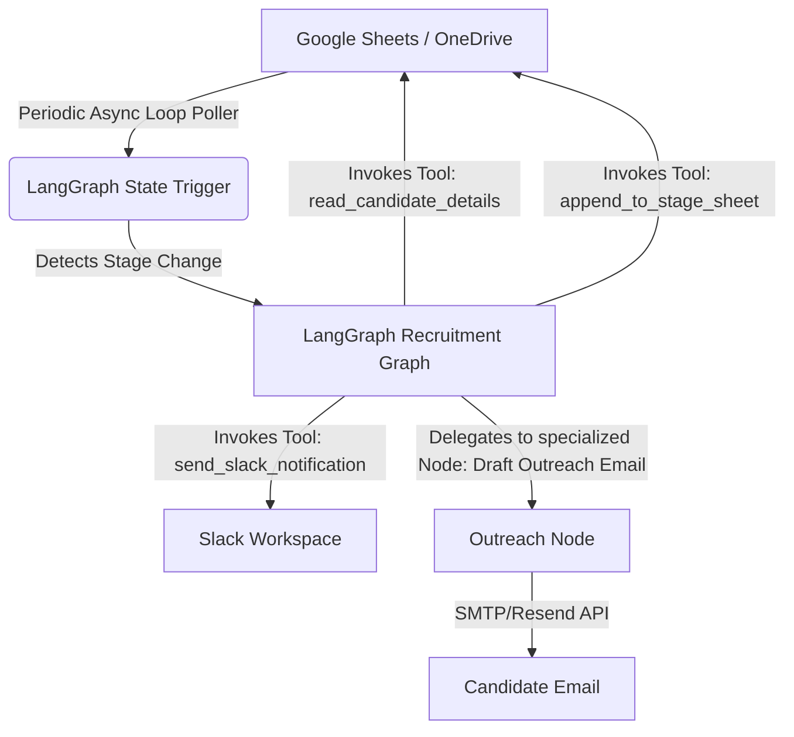

# HR Recruitment Automation Plan (LangChain/LangGraph)

This plan details the implementation of an automated sync pipeline for the HR Recruitment Department at Startup Greece. The system will monitor candidate stages in Google Sheets or Microsoft OneDrive and automatically move candidate data to the appropriate stage worksheet (Screening, Technical Interview, Cultural Fit, Offer, Onboarding) while keeping all logs and notes consistent.

---

## Modern Agentic Framework Recommendation

For this case study, we recommend **LangGraph** (the orchestration framework for **LangChain**) paired with **Gemini 3.5 Flash** (via `langchain-google-genai`).

### Why LangGraph & LangChain is the Best Fit:
1. **Stateful Graph Orchestration**: LangGraph allows modeling the recruitment pipeline as a stateful graph where nodes represent specific validation/data copying actions and edges represent transitions (e.g., stage updates).
2. **First-class Structured Outputs**: Direct support for Pydantic-based structured outputs using `.with_structured_output(...)` on the Gemini LLM model wrapper.
3. **Custom Tool Binding**: Python functions for reading/writing spreadsheets can be easily decorated as LangChain tools using `@tool` and bound to the agent.
4. **Rich Ecosystem**: Extensive built-in tool integrations and support for multi-agent supervisor patterns if the workflow expands.

---

## Proposed System Architecture

---

## User Review Required

> [!IMPORTANT]
> **Source Spreadsheets**: We need mock spreadsheet structures or exact columns for all stages (Inbound, Screening, Technical Interview, Cultural fit, Offer, Onboarding) to define mapping tools.
> **Hosting & Infrastructure**: Decide if we should deploy this as a continuous script on a service like Railway/Render or run it periodically on a local machine.

---

## Open Questions

> [!IMPORTANT]
> 1. Are your HR recruitment spreadsheets currently stored on **Google Sheets (Google Drive)** or **Excel (Microsoft OneDrive/SharePoint)**?
> 2. What columns represent the candidate's unique identifier (e.g., `Email` or `Candidate ID`) and transition trigger (e.g., `Status` = "Proceed to Tech Interview")?
> 3. Do you have a Slack Channel webhook or credentials available for notifications?

---

## Proposed Changes

### [HR Automation Component]
We will initialize a Python script structure inside the newly created `HR` folder.

#### [NEW] [requirements.txt](file:///Users/olingajoseph/Documents/My%20projects/startup%20greece/HR/requirements.txt)
Defines project dependencies.
- `langchain`
- `langchain-google-genai`
- `langgraph`
- `google-api-python-client` (or MSAL depending on spreadsheet choice)
- `python-dotenv`

#### [NEW] [agent.py](file:///Users/olingajoseph/Documents/My%20projects/startup%20greece/HR/agent.py)
The primary entry point of the automation service. Implements the LangGraph pipeline, the custom spreadsheet tools, and the background polling loop.

#### [NEW] [config.py](file:///Users/olingajoseph/Documents/My%20projects/startup%20greece/HR/config.py)
Handles API keys, scopes, sheet IDs, and other configurable constants loaded from `.env`.

---

## Verification Plan

### Automated Tests
We will write lightweight validation test suites in a scratch test script:
- Test spreadsheet authentication.
- Test change-detection algorithm with mock CSV/sheet updates.

### Manual Verification
1. We will set up mock sheets with sample candidate rows.
2. We will manually edit the status of a candidate to triggering status (e.g., "Screening" to "Technical Interview").
3. Verify that the candidate is copied to the "Technical Interview" sheet and a Slack/log message is produced.
