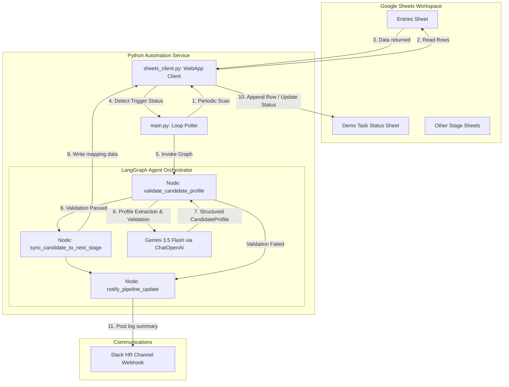
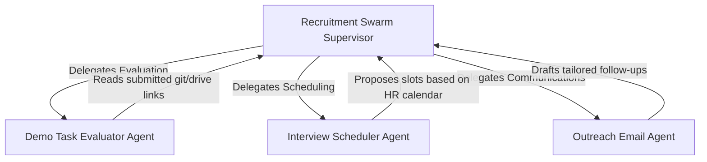

# AI Agent Swarm Orchestration Architecture

This document describes the architectural flow and agentic orchestration of the **HR Recruitment Pipeline Automation** at Startup Greece.

---

## 1. System Overview

The system uses a **polling trigger** to monitor state transitions in Google Sheets via a Google Apps Script Web App, then runs a stateful **LangGraph pipeline** (powered by LangChain and Gemini 3.5 Flash) to validate candidates, structure profiles, sync data to corresponding stages, and notify HR staff.

---

## 2. Component Descriptions

### A. Poller (`main.py`)
- Executes continuously (or once with `--once` flag).
- Reads candidate rows from the primary **`Entries`** tab.
- Filters candidates based on trigger status (`Status` = `OPEN`/`Pending` and `Stage` = `Demo Task`).
- Maintains an in-memory name lookup from the target sheet (`Demo Task Status`) to prevent duplicates.

### B. Client Driver (`sheets_client.py`)
- Dynamically acts as the transport layer.
- Handles requests through the **Google Apps Script Web App** (HTTP REST GET/POST) to read, append, and update rows.
- Safely falls back to local mock CSV worksheets if the Web App is offline.

### C. LangGraph State Workflow (`agent.py`)
LangGraph structures the lifecycle of a candidate sync sweep into state nodes:

1. **State Definition (`CandidateState`)**:
   Holds the candidate row details, current and target stages, validation statuses, validation profiles, and log registries.
2. **Validation Node (`validate_candidate_profile`)**:
   Extracts candidate fields (Name, Email, Role) dynamically to support split name columns. Invokes the Gemini LLM with a Pydantic `CandidateProfile` model schema to clean, standardize, and summarize the candidate profile.
3. **Sync Node (`sync_candidate_to_next_stage`)**:
   Maps candidate fields to target worksheet headers (e.g. constructing columns for `Demo Task Status` like `Demo Task Evaluation = Demo Task Evaluation - Name`).
4. **Notification Node (`notify_pipeline_update`)**:
   Consolidates execution logs and posts a formatted markdown message to the team's Slack channel webhook.

---

## 3. Future Multi-Agent Expansion (Orchestration Swarm)

As the HR pipeline matures, we can transition this single-agent graph into a **Multi-Agent Swarm** where specialized agents cooperate:

1. **Recruitment Supervisor Agent**:
   Tracks the overarching stage transitions and delegates candidate profiles to subagents.
2. **Demo Task Evaluator Agent**:
   Monitors submission folders or links, reviews candidate code/demo task submissions, and updates evaluations.
3. **Interview Scheduler Agent**:
   Interacts with calendars to coordinate interview dates and updates worksheets.
4. **Outreach Agent**:
   Drafts personalized stage transition emails or invitations and requests human review in Slack before sending.
